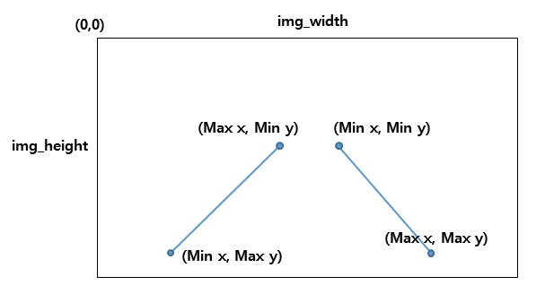
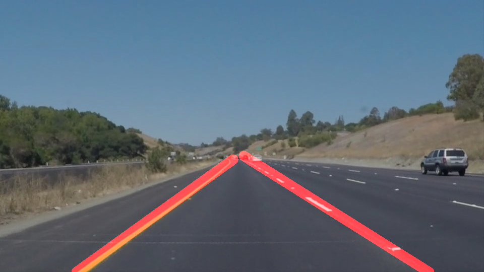

# **Finding Lane Lines on the Road** 

## Writeup 

---

### Reflection

### 1. Describe your pipeline. As part of the description, explain how you modified the draw_lines() function.

My pipeline consisted of 5 steps. 

1. Converting an image to grayscale in preparation for detecting Canny edges.
2. Detecting lines using Canny Edge detection with Gaussian Blur : setting kernel size as 3, lower and high threshold as 30 and 90.
3. Masking interested region : Assuming images are taken from vehicle, I masked interested region as a triangle. Because image sizes can be changed, I set region not with pixel values but with ratio.
4. Hough Trasform : With Hough transform, we can detect more delicate lines.
5. Draw Averaging lines  
    (1) Detect Left and Right lanes: Since (0,0) is at the left top of the image, unlike what it is seemed, right lane has positive slope while left lane has negative. I set the threshold as 0.5 and -0.5.
      

    (2) Find top and bottom X point for each lane.
      

    (3) Draw line from top points to the bottom.

**Final outputs are as below**.  
  
  
  
  

### 2. Identify potential shortcomings with your current pipeline

One potential shortcoming is that this algorithm assumes left and right lanes are straight. So curves cannot be detected as smoothly as straight lanes.

Another shortcoming is that it didn't count on the distance with objects in front of the vehicle. So there is a possibility that objects with bright color are detected as lanes.

### 3. Suggest possible improvements to your pipeline

A possible improvement can be drawing lanes with several seperate lines not one straight line. With this logic, curves lanes could be detected.

Another possible improvement is removing outliers while detecting lanes. With present algorithm, error values can interrupt calculating slope of each lane resulting in wrong lines. 
